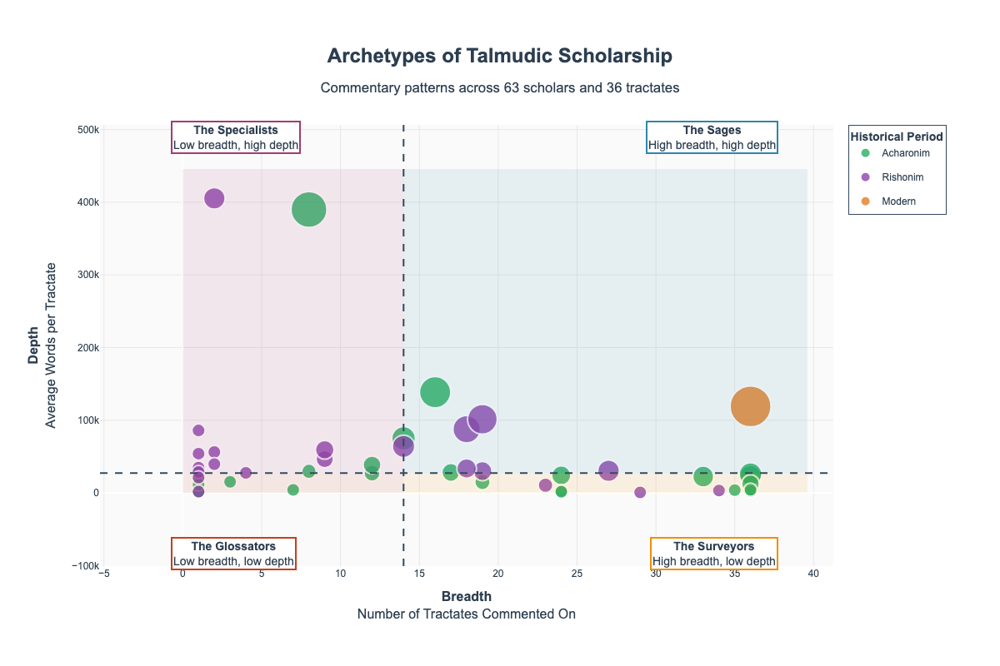

# Talmudic Commentary Analysis

## Overview

This project represents a comprehensive extraction and analysis of Talmudic commentary from a local MongoDB instance containing the complete Sefaria database. The methodology initially extracted over 30 million Hebrew words from 63 entries across all 36 tractates of the Babylonian Talmud. After cleaning, the dataset now contains 47 legitimate scholars with properly merged works.

## Project Background

### Approach
Extraction methodology was developed that:
- Filters for Hebrew language content only
- Targets Talmudic tractates specifically
- Handles multiple document structure formats
- Properly detects Hebrew text using Unicode ranges
- Maintains API-compatible output format

## Results Summary

### Initial Extraction Statistics
- **Total Entries Extracted**: 63
- **Total Tractates Covered**: 36 (complete Babylonian Talmud)
- **Total Files Extracted**: 876
- **Total Hebrew Words**: 30,215,148
- **Total Commentary Sections**: 63,976
- **Total Text Blocks**: 330,959
- **Success Rate**: 75.8%

### Data Consolidation Process
After the initial extraction, I cleaned the data to ensure quality and accuracy:

#### 1. Removed Non-Commentary Entries (4 deletions)
These generic labels and descriptive notes were not commentaries by identifiable authors:
- **Nuschaot Ktav Yad**: "Manuscript Versions" - A label for textual variants
- **Hagahot MeAlfas Yashan**: "Glosses from an old copy of Alfasi" - Anonymous marginal notes
- **Ha'atakat Teshuvat HaRif**: "Transcription of a Responsum of the Rif" - A source note, not commentary
- **Reshimot Shiurim**: "Lecture Notes" - Falls outside the scope of formal commentary

#### 2. Merged Duplicate Entries (2 consolidations)
Identical entities listed with different spellings or names:
- **Shita Mekubbetzet** → **Shita Mekubetzet**: Alternative spellings of the same work
- **Commentary of the Rosh** → **Rosh**: Same author and work with different naming

#### 3. Merged Works Under Canonical Authors (7 consolidations)
To accurately represent each scholar's total contribution,  merged their individual works:
- **Maharsha**: Merged Chidushei Agadot and Chidushei Halachot
- **Ramban (Nachmanides)**: Merged Chiddushei Ramban, Sefer HaZekhut, and Hilkhot HaRamban
- **Yom-Tov Lipmann Heller**: Merged Maadaney Yom Tov, Divrey Chamudot, and Pilpula Charifta
- **Rabbi Akiva Eiger**: Merged Chiddushei Rabbi Akiva Eiger and Gilyon HaShas
- **Rabbeinu Zerachya ha-Levi (Baal HaMaor)**: Merged HaMaor HaGadol, HaMaor HaKatan, and Milchemet Hashem
- **Yosef Hayyim of Baghdad (Ben Ish Hai)**: Merged Ben Yehoyada and Benayahu
- **Chida (Rabbi Chaim Yosef David Azulai)**: Merged Marit HaAyin and Petach Einayim

### Final Dataset Statistics
- **Total Legitimate Scholars**: 47
- **Total Hebrew Words**: ~30 million (consolidated)
- **Complete Coverage**: All 36 Babylonian Talmud tractates

## Key Features

### 1. Comprehensive Scholar Coverage
After consolidation, our 47 legitimate scholars include:
- **Rishonim (Medieval)**: Major authorities like Ramban, Rashba, Ritva, Ran, Meiri, Rosh
- **Acharonim (Post-Medieval)**: Later scholars including Maharsha, Rabbi Akiva Eiger, Penei Yehoshua, Yosef Hayyim (Ben Ish Hai), Chida, Yom-Tov Lipmann Heller
- **Modern**: Steinsaltz

### 2. Complete Tractate Coverage
All 36 tractates of the Babylonian Talmud are represented:
- **Seder Zeraim**: Berakhot
- **Seder Moed**: Shabbat, Eruvin, Pesachim, Yoma, Sukkah, Beitzah, Rosh Hashanah, Taanit, Megillah, Moed Katan, Chagigah
- **Seder Nashim**: Yevamot, Ketubot, Nedarim, Nazir, Sotah, Gittin, Kiddushin
- **Seder Nezikin**: Bava Kamma, Bava Metzia, Bava Batra, Sanhedrin, Makkot, Shevuot, Avodah Zarah, Horayot
- **Seder Kodashim**: Zevachim, Menachot, Chullin, Bekhorot, Arakhin, Temurah, Keritot, Meilah, Niddah

### 3. Data Quality Assurance
- Hebrew text properly detected using Unicode ranges (0x0590-0x05FF)
- HTML tags and formatting preserved for scholarly analysis
- Consistent JSON structure across all extractions
- Comprehensive error handling and reporting

## Visualizations

This project includes five sophisticated visualization analyses that reveal different aspects of Talmudic scholarship patterns:

### 1. Archetypes of Scholarship
**Categorizes scholars by their commentary approach based on breadth vs. depth**



This visualization maps 47 scholars across four distinct archetypes:
- **The Sages** (upper right): High breadth + high depth - comprehensive scholars like Steinsaltz
- **The Specialists** (upper left): Low breadth + high depth - focused experts like Shita Mekubetzet  
- **The Surveyors** (lower right): High breadth + low depth - broad coverage scholars
- **The Glossators** (lower left): Low breadth + low depth - targeted commentators

*Interactive version: [`visualization/archetypes/`](visualization/archetypes/)*

#### Distribution Summary


The pie charts show the distribution of scholars across archetypes and historical periods, providing quantitative insight into scholarly patterns.

### 2. Center of Gravity Analysis
**Tracks shifting scholarly focus across the six orders of the Talmud**


Compares commentary distribution between Rishonim (Medieval) and Acharonim (Post-Medieval) periods across the six orders (Sedarim), revealing how scholarly priorities shifted over time from practical law to theoretical discussions.

*Interactive version: [`visualization/center_of_gravity/`](visualization/center_of_gravity/)*

### 3. Evolving Style of Commentary
**Analyzes whether commentary became more verbose over time**


Statistical analysis comparing average commentary length between historical periods, revealing trends in scholarly writing style and the evolution from concise glosses to elaborate explanations.

*Interactive version: [`visualization/evolving_style/`](visualization/evolving_style/)*

### 4. Weight of Conversation
**Identifies tractates that generated disproportionate commentary**


Measures commentary density relative to tractate length (in dapim/folios), highlighting which topics were most "conversation-worthy" and generated intense scholarly discussion.

*Interactive version: [`visualization/weight_of_conversation/`](visualization/weight_of_conversation/)*

## Top Scholars by Content Volume

Note: These figures reflect the consolidated dataset where multiple works by the same author have been merged.

1. **Steinsaltz**: 4,284,732 words (36 tractates) - Modern comprehensive commentary
2. **Shita Mekubetzet**: 2,826,936 words (6 tractates) - Compilation of rishonim
3. **Penei Yehoshua**: 2,217,240 words (16 tractates) - Analytical commentary
4. **Rashba**: 1,926,310 words (19 tractates) - Major rishon authority
5. **Maharsha**: Combined halakhic and aggadic innovations across multiple tractates

## Technical Implementation

### MongoDB Query Strategy
```python
pattern = {
    "title": {
        "$regex": f"^(.+) on ({tractate_pattern})$",
        "$options": "i"
    },
    "language": "he"  # Hebrew content only
}
```

### Hebrew Text Detection
```python
def is_hebrew(self, text):
    """Check if text contains Hebrew characters."""
    hebrew_chars = sum(1 for char in text if 0x0590 <= ord(char) <= 0x05FF)
    return hebrew_chars > 0
```

### Data Structure Handling
The extraction handles both list and dictionary chapter structures:
- **List format**: Common in Rashi, Tosafot commentaries
- **Dictionary format**: Used by Meiri and other systematic commentators

## Data Format

Each extracted file follows this JSON structure:
```json
{
  "Scholar_on_Tractate.section_X": [
    "Hebrew text line 1",
    "Hebrew text line 2",
    "..."
  ],
  "Scholar_on_Tractate.section_Y": [
    "Hebrew text line 1",
    "..."
  ]
}
```

## Dependencies

- **Python 3.7+**
- **pymongo**: MongoDB database connection
- **json**: JSON data processing
- **os**: File system operations
- **collections**: Data structure utilities
- **re**: Regular expression processing

## Installation

1. Ensure MongoDB is running with Sefaria database loaded
2. Install required Python packages:
   ```bash
   pip install pymongo
   ```
3. Update MongoDB connection string in scripts if needed

## Usage

### Basic Extraction
```bash
python3 talmudic_extractor.py
```

### Comprehensive Analysis
```bash
python3 comprehensive_summary.py
```

## File Descriptions

- **talmudic_extractor.py**: Main extraction script that processes MongoDB documents
- **comprehensive_summary.py**: Generates detailed analysis and statistics
- **extraction_report.json**: Detailed extraction results and metadata
- **comprehensive_analysis_report.json**: Complete analysis with word counts and distributions

## Research Applications

This dataset enables numerous research applications:
- **Comparative commentary analysis** across different periods
- **Linguistic studies** of Hebrew commentary evolution
- **Scholarly influence mapping** through citation patterns
- **Historical development** of Talmudic interpretation
- **Digital humanities** research on Jewish texts

## Data Quality Metrics

- **Content Coverage**: 47 legitimate scholars after consolidation (from 63 initial entries)
- **Text Integrity**: 5.2 text blocks per section average
- **Language Purity**: Hebrew Unicode detection ensures text quality
- **Structural Consistency**: Standardized JSON format across all extractions
- **Data Curation**: Removed 4 non-commentary entries, merged 19 duplicate/related works

## Future Enhancements

1. **Cross-reference analysis** beten commentators
2. **Temporal analysis** of commentary development
3. **Geographic distribution** of scholarly traditions
4. **Citation network mapping** between scholars
5. **Advanced text analytics** and natural language processing

## License

This project is part of the RInfluence research initiative. The extracted data represents digitized versions of traditional Jewish texts and commentaries available through Sefaria.org.

## Contributing

For questions, issues, or contributions, please refer to the main RInfluence project repository.

## Acknowledgments

This project builds upon the comprehensive digital library provided by Sefaria.org and represents a significant advancement in digital humanities research on Jewish texts.
